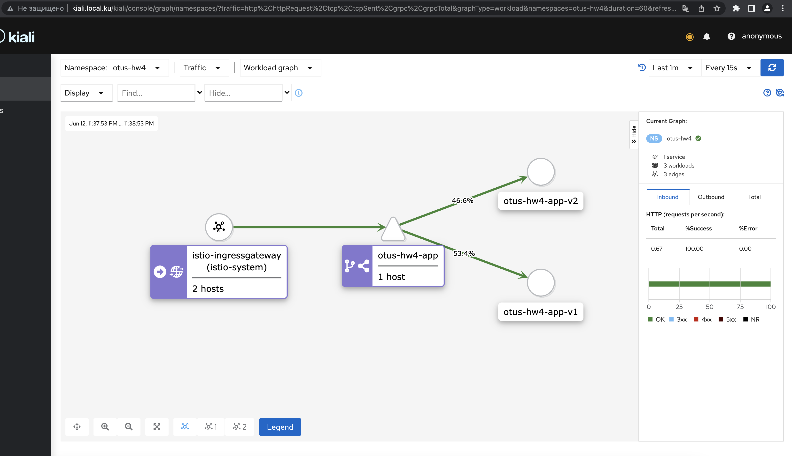

## ДЗ №4 
### Балансировка трафика 50/50 между версиями сервиса, использование istio-ingress-gateway для доступа вне кластера 
1) Разворачиваем istio вместе с kiali, prometheus, jaeger 
2) Разворачиваем gateway с virtualservice для доступа к kiali:  
kubectl apply -f ./deploy/templates/kiali/gateway.yaml 

3) Развораичваем приложение с двумя версиями и gateway с virtualservice, назначаем destination rules:  
kubectl apply -f ./deploy/templates/applications.yaml 
kubectl apply -f ./deploy/templates/gateway.yaml  
    
4) Вызов приложения:  
GET -x http://arch.istio.homework/app/version 
   
 